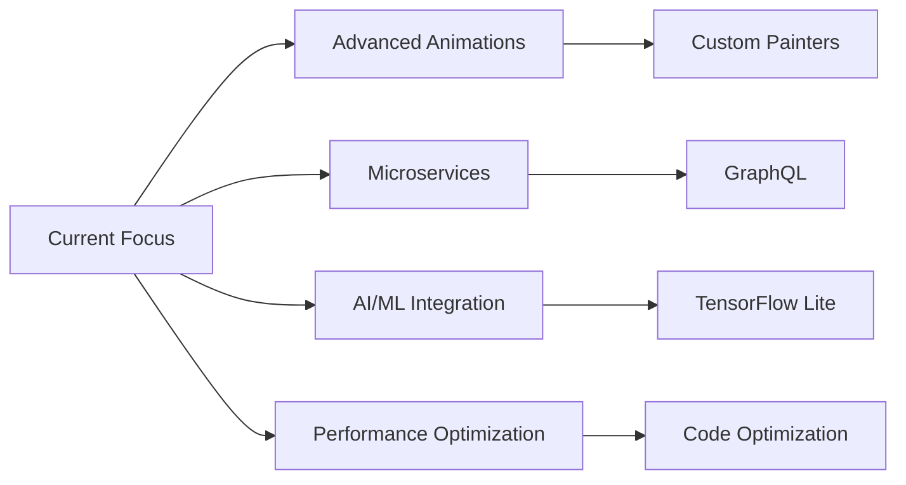

<!-- ===================== Animated Header ===================== -->
<div align="center">


<p align="center">
  
</p>

<p align="center">
🚀 Crafting modern, scalable, and high-performance mobile applications with Flutter
</p>

</div>

---

<!-- ===================== About Me ===================== -->
## 👩‍💻 About Me

I am a **passionate Flutter Developer** and graduate of the **Faculty of Computers & Artificial Intelligence**.  
I completed intensive training programs at **ITI** and **DEPI**, where I built real-world mobile applications using industry best practices.

**What drives me:**
- 🎨 Creating **pixel-perfect, responsive UIs**
- 🏗️ Implementing **scalable architectures**
- ⚡ Optimizing **app performance**
- 🔐 Building **secure authentication systems**
- 📚 Continuously **learning and growing**

---

<!-- ===================== Tech Stack ===================== -->
## 🛠 Tech Stack & Tools

<div align="center">

### 📱 Mobile Development
<p>
  
  
  
</p>

### 🔥 Backend & Services
<p>
  
  
  
  
</p>

### 🧠 State Management
<p>
  
  
  
</p>

### 🧰 Tools & Workflow
<p>
  
  
  
  
  
</p>

</div>

---

<!-- ===================== Animated Stats ===================== -->
## 📊 GitHub Analytics

<div align="center">


</div>

---

<!-- ===================== Projects ===================== -->
## 🚀 Featured Flutter Projects

<div align="center">

| Project | Description | Technologies |
|---------|-------------|--------------|
| 🍔 **Food Delivery App** | Full-featured food ordering platform with real-time order tracking | Flutter, Firebase, BLoC, Google Maps API |
| 🛒 **E-Commerce Platform** | Modern shopping app with cart, favorites, and payment integration | Flutter, REST APIs, Provider, Stripe |
| 🔐 **Authentication System** | Secure login/signup with email verification and password recovery | Flutter, Firebase Auth, Form Validation |
| 📝 **Task Management** | Productivity app with local storage and cloud sync | Flutter, Hive, Firebase Firestore |
| 🎬 **Movie Database** | Browse movies with search, filters, and detailed info | Flutter, TMDB API, BLoC Pattern |

</div>

### 💡 Project Highlights

#### 🍔 Food Delivery Application
```
Architecture: Clean Architecture with Feature-Based Structure
Features:
  ✓ User authentication & profile management
  ✓ Restaurant browsing with advanced filters
  ✓ Real-time order tracking
  ✓ Payment gateway integration
  ✓ Push notifications for order updates
Tech Stack: Flutter | Firebase | BLoC | Google Maps
```

#### 🛒 E-Commerce Mobile App
```
Architecture: MVVM with Provider
Features:
  ✓ Product catalog with search & filters
  ✓ Shopping cart & wishlist
  ✓ Secure checkout process
  ✓ Order history & tracking
  ✓ Product reviews & ratings
Tech Stack: Flutter | REST APIs | Provider | SQLite
```

➡️ **[View All Projects](https://github.com/Yasmeen-Adel?tab=repositories)**

---

<!-- ===================== Education ===================== -->
## 🎓 Education & Certifications

<table align="center">
<tr>
<td align="center" width="33%">

<br><b>University Degree</b>
<br>Computers & AI
</td>
<td align="center" width="33%">

<br><b>ITI Training</b>
<br>Mobile Development
</td>
<td align="center" width="33%">

<br><b>DEPI Program</b>
<br>Advanced Flutter
</td>
</tr>
</table>

---

<!-- ===================== Currently Learning ===================== -->
## 🌱 Currently Exploring

<div align="center">



</div>

---

<!-- ===================== GitHub Activity ===================== -->
## 📈 Contribution Graph

<div align="center">

[](https://github.com/Yasmeen-Adel)

</div>

---

<!-- ===================== Contact ===================== -->
## 🌐 Let's Connect!

<div align="center">

<p>
<a href="https://github.com/Yasmeen-Adel" target="_blank">
  
</a>
<a href="https://www.linkedin.com/in/yasmeen-adel-ba4b36265" target="_blank">
  
</a>
<a href="mailto:ya1903@fayoum.edu.eg">
  
</a>
</p>

<p>
  <a href="https://github.com/Yasmeen-Adel">
    
  </a>
  <a href="https://github.com/Yasmeen-Adel">
    
  </a>
</p>

</div>

---

<!-- ===================== Quote ===================== -->
<div align="center">

### 💭 Dev Quote


</div>

---

<!-- ===================== Footer ===================== -->
<div align="center">


### ✨ *"Code is poetry written in logic"* ✨

<p>
  
  
</p>

**Thank you for visiting my profile! Feel free to explore my repositories and reach out for collaboration! 🚀**

</div>
 
